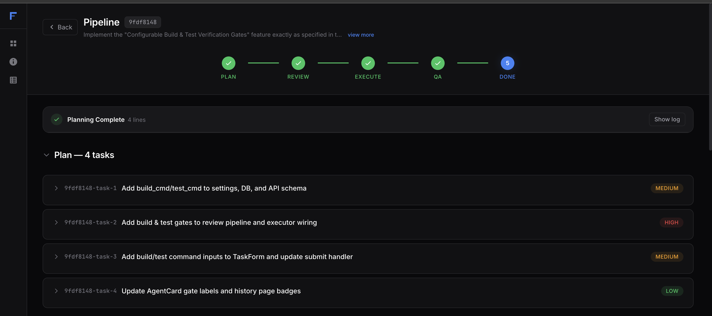
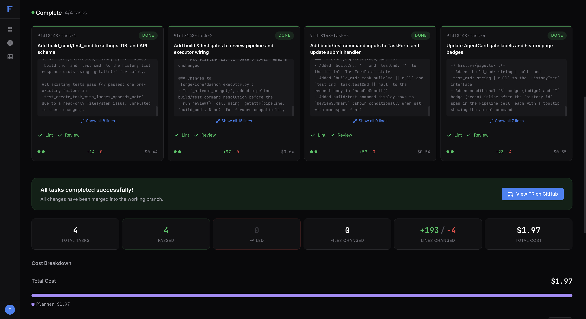
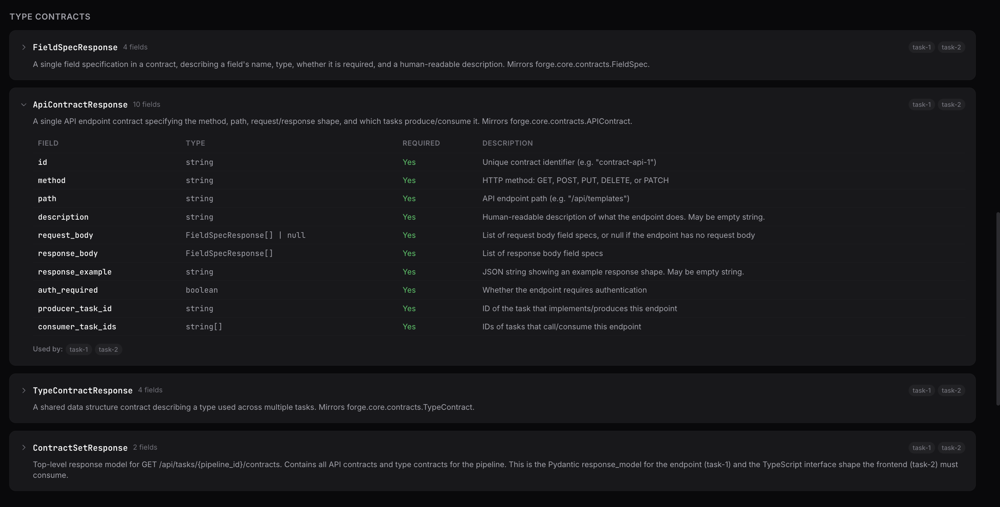

<div align="center">

# Forge

### One command. Multiple agents. Contracts before code. PRs that actually work.

[](https://python.org)
[](https://docs.anthropic.com/en/docs/claude-code)
[](https://nextjs.org)
[](LICENSE)

AI agents that agree on interfaces before writing code — so your backend and frontend are compatible on the first try.

[Install](#install) · [Quick Start](#quick-start) · [How It Works](#how-it-works) · [Contract Builder](#contract-builder) · [Terminal UI](#terminal-ui) · [Web Dashboard](#web-dashboard) · [Configuration](#configuration)

</div>

<br/>

```bash
forge run "Build a REST API with JWT auth, user registration, and integration tests"
```

That's it. Forge plans the work, generates interface contracts so agents agree on API shapes before writing a line of code, spins up agents in parallel, reviews their output, and opens a pull request when everything passes.

<br/>

<p align="center">
  
</p>

<p align="center">
  
</p>

---

## Why Forge?

Writing code with an AI assistant is powerful — but you're still the bottleneck. You prompt one thing at a time, manually review every change, copy-paste between files, and pray that the backend and frontend agree on field names. Forge removes all of that.

| Pain point | How Forge solves it |
|---|---|
| You prompt one thing at a time | Forge decomposes your task into a **dependency graph** and runs independent tasks **in parallel** |
| Parallel agents produce incompatible interfaces | The **Contract Builder** generates binding API & type contracts *before* any code is written — agents build against the same spec |
| AI changes break other code | Each agent works in an **isolated git worktree** — no file conflicts between concurrent agents |
| You manually review AI output | A **multi-gate review pipeline** (build > lint > test > LLM review > contract compliance > merge check) catches issues before anything touches `main` |
| Agents make the same mistake twice | **Self-evolving learning** detects retry loops and persists lessons across runs — agents don't repeat past failures |
| No visibility into what agents are doing | Full **Terminal UI** with live agent output, DAG view, and real-time cost tracking |
| Context gets lost in long sessions | Each agent is a **fresh Claude session** with a focused prompt + its relevant contracts — no context bleeding |
| Merging is manual and error-prone | Forge **rebases and fast-forward merges** each task, then auto-creates a **pull request** |
| You can't control AI spend | **Per-pipeline budget limits** with real-time cost tracking — hard stop when the budget is hit |

---

## Features at a Glance

🧠 **Multi-Pass Planning** — Not a single LLM call. A 4-stage pipeline: Scout explores your codebase → Architect decomposes tasks → Detailers enrich in parallel → Validator checks consistency. The result is a dependency graph that actually makes sense.

🔗 **Interface Contracts** — Agents agree on API shapes, field names, and types *before* writing code. Producers implement the spec, consumers call the spec. [Details →](#contract-builder)

🖥️ **Terminal UI** — Full Textual TUI with DAG visualization, command palette (`Ctrl+P`), live agent output streaming, inline diff review, and keyboard navigation (`j`/`k`, `Tab`, `/`). [Details →](#terminal-ui)

🤝 **Human-in-the-Loop** — Agents ask questions mid-execution. You can send interjections to running agents. Plan approval before execution. Diff approval before merge. Full control without blocking parallelism.

🧬 **Self-Evolving Learning** — RuntimeGuard detects wasteful retry loops (same failing command 3× = hard stop). LessonStore persists lessons across runs — agents learn from past mistakes. [Details →](#self-evolving-learning)

🌐 **Multi-Repo Workspaces** — Single pipeline across frontend/backend/infra repos. Each task writes to exactly one repo. Agents can read all repos. *(Design phase)*

💰 **Budget Control & Model Routing** — Per-pipeline spend caps with real-time cost tracking. Route tasks to Haiku, Sonnet, or Opus based on complexity.

🔍 **Language-Agnostic Lint Gate** — Auto-detects: pre-commit hooks, npm scripts, Makefile targets, or falls back to language-specific tools (ruff, eslint, gofmt, cargo clippy, rubocop, ktlint, swiftlint, shellcheck). Two-pass: fix then verify.

---

## Install

> **Prerequisites:** Git 2.20+, [Claude Code CLI](https://docs.anthropic.com/en/docs/claude-code) (`claude login`), and optionally [`gh` CLI](https://cli.github.com) for auto-PR creation.

### One-command install

```bash
curl -fsSL https://raw.githubusercontent.com/tarunms7/forge-orchestrator/main/install.sh | sh
```

Installs [uv](https://docs.astral.sh/uv/) + Forge + Python 3.12 (if needed), creates the data directory, and runs `forge doctor`. Idempotent — safe to re-run to upgrade.

### Manual install

```bash
git clone https://github.com/tarunms7/forge-orchestrator.git  # Clone the repo
cd forge-orchestrator                                          # Enter project dir
uv tool install .                                              # Install as global CLI tool
mkdir -p ~/.local/share/forge                                  # Create data directory
forge doctor                                                   # Verify setup
```

No virtual environment activation required — `uv tool` installs Forge as a global command.

---

## Quick Start

```bash
curl -fsSL https://raw.githubusercontent.com/tarunms7/forge-orchestrator/main/install.sh | sh
cd your-project
forge tui
```

That's it. Forge auto-creates `.forge/` in your project on first run. Or run a task directly:

```bash
forge run "Add input validation to all API endpoints"
```

---

## How It Works

```
forge run "your task"
        │
   1. PLAN ─────────┐
        │            │  Scout explores codebase
        │            │  Architect decomposes tasks
        │            │  Detailers enrich in parallel
        │            │  Validator checks consistency
        │◄───────────┘
   2. CONTRACT ───→ Generates binding API & type contracts from integration hints
        │
   3. EXECUTE ────→ Task pool dispatches agents to isolated worktrees (continuous, not batch)
        │
   4. REVIEW ─────→ Multi-gate: build › lint › test › LLM review › contract compliance
        │
   5. MERGE ──────→ Rebase + fast-forward into working branch, auto-create PR
```

**Plan** — The multi-pass planner runs four specialized stages. Scout gathers codebase context. Architect creates a task DAG with dependencies and complexity ratings. Detailers enrich each task with file paths and integration hints — in parallel. Validator ensures the full plan is consistent. You approve the plan before execution starts.

**Contract** — The Contract Builder generates precise API and type contracts from integration hints + codebase context — *before* any code is written.

**Execute** — A continuous task pool dispatches work as dependencies resolve — not in rigid batches. Each task gets its own git worktree. Producers implement exact response shapes; consumers receive exact shapes to expect. Two agents, same spec, compatible on first try.

**Review** — Every task passes up to 5 gates: build, lint, test, LLM review (diff + contract compliance), and merge readiness check.

**Merge** — Task branches are rebased and fast-forward merged. When all tasks pass, Forge runs `gh pr create`. If any step fails, Forge retries up to 3 times with failure feedback.

---

## Contract Builder

> The #1 problem with multi-agent code generation isn't quality — it's **integration**. Two agents writing a backend API and a frontend client will independently invent different field names, response shapes, and auth patterns. Forge solves this with contracts.

<p align="center">
  
</p>

**API Contracts** define exact endpoint shapes:
```
POST /api/templates
  Request:  { name: string, description: string, tasks: TaskConfig[] }
  Response: { id: string, name: string, created_at: string }
  Producer: task-1 (backend)  |  Consumer: task-2 (frontend)
```

**Type Contracts** define shared data structures:
```
PipelineTemplate:
  id: string          — UUID for user-created, slug for built-in
  name: string        — Display name
  description: string — Human-readable summary
  tasks: TaskConfig[] — Array of task configurations
  Used by: task-1, task-2, task-3
```

### How contracts flow

1. **Planner** flags integration hints: *"task-1 produces a REST API that task-2 consumes"*
2. **Contract Builder** generates precise contracts from hints + codebase context
3. **Agents** receive contracts in their system prompt — producers implement the spec, consumers call the spec
4. **Reviewers** verify contract compliance in each diff
5. Contracts degrade gracefully — if generation fails, agents proceed without them

---

## Terminal UI

```bash
forge tui
```

A full terminal interface built with [Textual](https://textual.textualize.io/). No browser needed.

- **Home screen** — Logo, recent pipelines, prompt input with suggestion chips. Type a task and go.
- **Pipeline screen** — Split-pane view: task list on the left, live agent output on the right. Watch agents work in real time.
- **Review screen** — Inline diff viewer for every task. Approve or reject changes before merge.
- **Settings screen** — Configure model strategy, budget limits, and approval requirements.
- **DAG overlay** — Toggle with `g` to see the full task dependency graph.
- **Command palette** — `Ctrl+P` to jump between screens, pipelines, and actions.
- **Agent interaction** — Agents can ask questions mid-execution; answer inline. Send interjections to running agents without stopping them.
- **Smart launch** — Auto-detects if the Forge daemon is already running. If not, embeds one — no manual server management.

Keyboard-driven: `j`/`k` to navigate, `Tab` to switch panes, `/` to search, `?` for help.

---

## Self-Evolving Learning

Agents that repeat mistakes waste time and money. Forge's learning system fixes this at two levels.

**RuntimeGuard** monitors agent commands in real time. If an agent runs the same failing command three times, it gets a hard stop — not another retry. Commands are normalized (UUIDs, temp paths stripped) so variations of the same failure are caught. Warning on the 2nd attempt, kill on the 3rd.

**LessonStore** persists lessons in the database, scoped globally or per-project. Categories include command failures, review failures, code patterns, and infra timeouts. On every new agent session, relevant lessons are injected into the prompt as "DO NOT repeat these mistakes."

Agents also self-report: when a retry succeeds after a failure, the agent records what worked — so the next agent starts with the answer instead of discovering it the hard way.

---

## Web Dashboard

```bash
forge serve   # Backend :8000 + Frontend :3000
```

> Requires `pip install forge-orchestrator[web]` and a git clone for the `web/` directory. Set `FORGE_JWT_SECRET` for multi-user auth.

- **Live pipeline progress** via WebSocket with streaming agent output
- **Interactive plan editing** — reorder, add/remove tasks, edit dependencies
- **Contract viewer** — API & type contracts with producer/consumer linkage
- **Review gate results** — build, lint, test, and LLM review status per task
- **Pre-merge approval** — review diffs before merge
- **Real-time cost tracking** with budget enforcement
- **Pipeline history** with duration, task counts, and cost

---

## Configuration

All settings use the `FORGE_` prefix. See [`.env.example`](.env.example) for the full list.

Build and test commands are **auto-detected** from your project (`package.json`, `Makefile`, `pyproject.toml`, etc.).

| Setting | Default | Description |
|---|---|---|
| `FORGE_DATA_DIR` | `~/.local/share/forge` | Central data directory |
| `FORGE_MAX_AGENTS` | 5 | Max concurrent agent sessions |
| `FORGE_AGENT_TIMEOUT_SECONDS` | 600 | Per-task timeout (10 min) |
| `FORGE_MAX_RETRIES` | 5 | Retries per task on failure |
| `FORGE_BUILD_CMD` | *(auto-detected)* | Build command |
| `FORGE_TEST_CMD` | *(auto-detected)* | Test command |
| `FORGE_LINT_CMD` | *(auto-detected)* | Lint check command |
| `FORGE_LINT_FIX_CMD` | *(auto-detected)* | Lint fix command |
| `FORGE_BUDGET_LIMIT_USD` | 0 (unlimited) | Per-pipeline spend cap |
| `FORGE_MODEL_STRATEGY` | auto | Model routing: `auto`, `fast`, `quality` |
| `FORGE_REQUIRE_APPROVAL` | false | Require human approval before merge |

```bash
FORGE_BUDGET_LIMIT_USD=5 FORGE_MODEL_STRATEGY=quality forge run "Refactor auth to OAuth2"
```

### Model routing

| Strategy | Planner | Contract Builder | Agent | Reviewer |
|---|---|---|---|---|
| `fast` | Sonnet | Sonnet | Haiku | Haiku/Sonnet |
| `auto` (default) | Opus | Opus | Sonnet/Opus | Sonnet |
| `quality` | Opus | Opus | Opus | Sonnet |

---

## Data Storage

```
~/.local/share/forge/          # Central (shared across all projects)
  forge.db                     #   Pipeline history, task state, cost tracking

your-project/.forge/           # Project-local
  worktrees/                   #   Isolated git worktrees for each task
  config/                      #   Project-specific settings
```

Pipeline history follows you across projects — `forge status --all` shows everything. Customize location with `FORGE_DATA_DIR` or `FORGE_DB_URL`.

---

## Code Delivery

Your code arrives as a **pull request** — never pushed directly to `main`:

1. Each task works in an isolated git worktree
2. After passing review + contract compliance, branches are rebased and fast-forward merged
3. When all tasks complete, Forge runs `gh pr create`
4. You review and merge through your normal workflow

---

## Troubleshooting

**`forge: command not found`** — Add `~/.local/bin` to your PATH, or re-run the installer.

**Database issues** — Run `forge doctor` to diagnose. Forge auto-creates the database on next run if missing.

**Claude CLI not authenticated** — Run `claude login`.

**`gh: command not found`** — Install the [GitHub CLI](https://cli.github.com) and run `gh auth login`.

---

## Limitations

- **Cost** — A 4-task pipeline makes ~12 Claude calls. Use `fast` strategy or set `FORGE_BUDGET_LIMIT_USD`.
- **Speed** — Tasks with dependencies run sequentially; independent tasks run in parallel.
- **Linting** — Lint gate auto-detects the language and runs the appropriate tool: `ruff` (Python), `eslint` (JS/TS), `gofmt` (Go), `cargo clippy` (Rust), `rubocop` (Ruby), `ktlint` (Kotlin), `swiftlint` (Swift), `shellcheck` (Shell). Override with `FORGE_LINT_CMD`/`FORGE_LINT_FIX_CMD`.
- **Multi-repo** — Multi-repo workspace support is currently in design phase. Single-repo pipelines are fully supported.
- **Merge conflicts** — If two tasks modify the same file, the later merge may fail and retry.
- **Contracts** — Adds ~15-30s to startup. Skipped automatically for single-task pipelines.

---

## Uninstall

```bash
uv tool uninstall forge-orchestrator                           # Remove the tool
rm -rf "${XDG_DATA_HOME:-$HOME/.local/share}/forge"            # Remove pipeline history
rm -rf .forge/                                                 # Remove per-project data (optional)
```

---

## License

MIT
