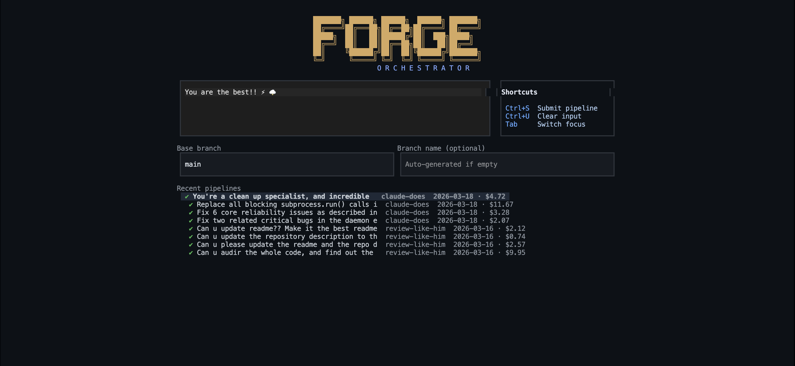
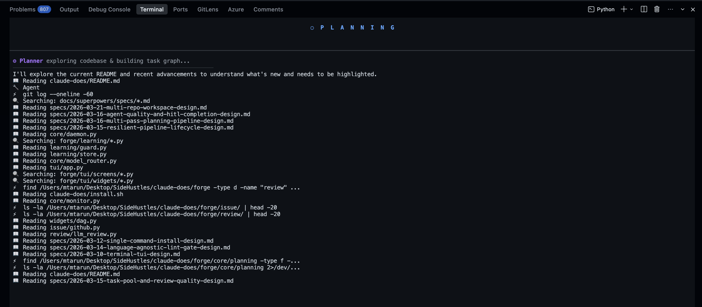
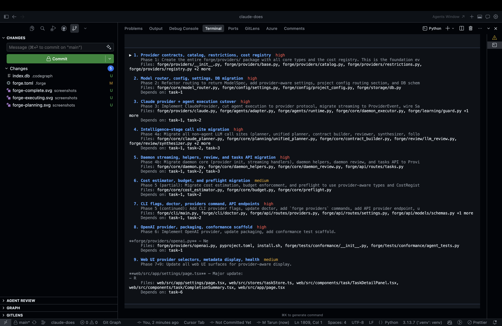
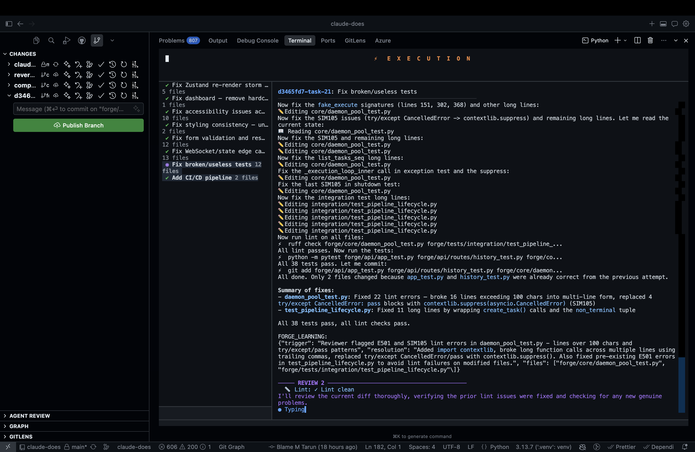
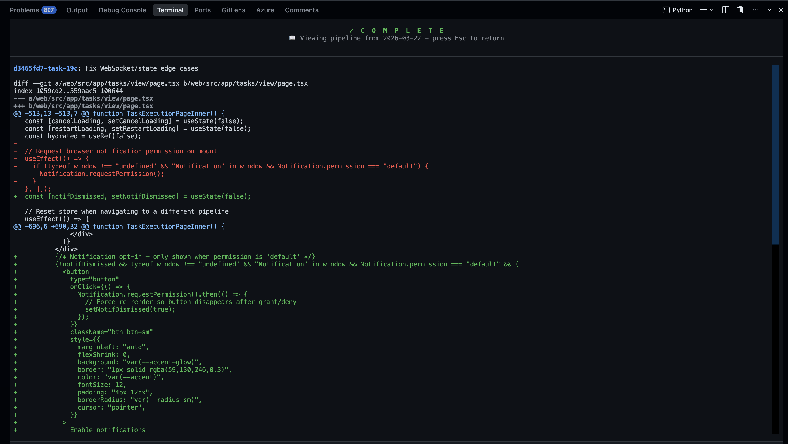
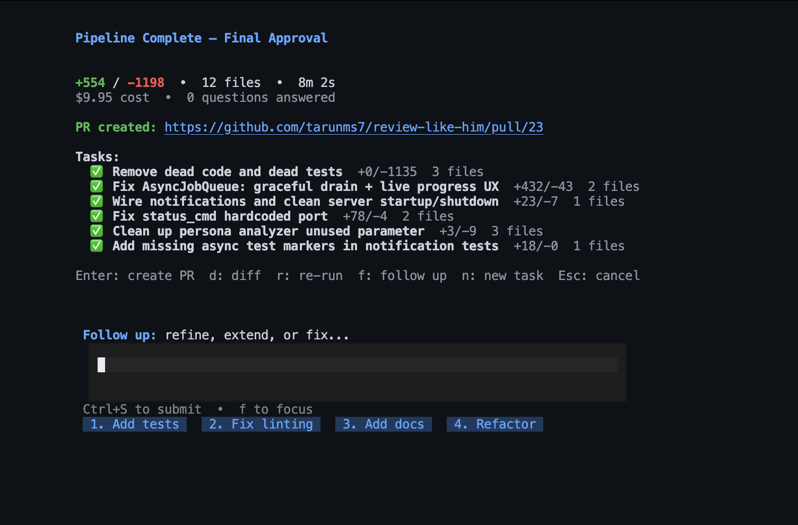

<div align="center">

# FORGE

### Ship features, not prompts.

[](https://python.org)
[](https://docs.anthropic.com/en/docs/claude-code)
[](LICENSE)
[](https://github.com/tarunms7/forge-orchestrator/actions/workflows/ci.yml)

Forge is a multi-agent orchestration engine. You describe what you want. Forge plans the work, generates interface contracts, runs agents in parallel, reviews every line, and opens a pull request.

**One command. Multiple agents. Reviewed code delivered via PR.**

[Install](#install) · [How It Works](#how-it-works) · [Screenshots](#see-it-in-action) · [Configuration](#configuration)

</div>

<br/>

```bash
forge tui
```

<p align="center">
  
</p>

Type your task. Hit Ctrl+S. Walk away. Come back to a pull request.

---

## What makes Forge different

Most AI coding tools are **chat interfaces**. You prompt, you wait, you review, you prompt again. You're still the bottleneck.

Forge is an **orchestration engine**. It breaks your task into a dependency graph, assigns each piece to an agent, and runs them in parallel — each in its own git worktree, each with its own review pipeline. When everything passes, you get a PR.

| You're doing this today | Forge does this instead |
|---|---|
| Prompting one thing at a time | Decomposes into a **DAG** and runs independent tasks **in parallel** |
| Hoping two AI-written files agree on an API shape | **Contract Builder** generates binding specs *before* any code is written |
| Manually reviewing every AI change | **5-gate review pipeline**: build, lint, test, LLM review, contract compliance |
| Copy-pasting between chat and terminal | Each agent works in an **isolated git worktree** — zero conflicts |
| Losing context in long sessions | Each agent is a **fresh session** with a focused prompt + its contracts |
| Merging by hand | Auto **rebase + fast-forward merge**, then `gh pr create` |
| No idea what the AI spend was | **Real-time cost tracking** with per-pipeline budget limits |

---

## See it in action

### Planning — Forge reads your codebase, then builds a task graph

<p align="center">
  
</p>

### Plan review — Approve, edit, or reject before any code is written

<p align="center">
  
</p>

### Execution — Agents work in parallel, learning from failures in real-time

<p align="center">
  
</p>

### Code review — Inspect every diff before merge

<p align="center">
  
</p>

### Done — PR created, cost tracked, ready to merge

<p align="center">
  
</p>

---

## Install

> **Prerequisites:** Git 2.20+ and [Claude Code CLI](https://docs.anthropic.com/en/docs/claude-code) (`claude login`).
> Optional: [`gh` CLI](https://cli.github.com) for automatic PR creation.

```bash
curl -fsSL https://raw.githubusercontent.com/tarunms7/forge-orchestrator/main/install.sh | sh
```

That's it. The installer handles Python 3.12, [uv](https://docs.astral.sh/uv/), and the Forge CLI. Safe to re-run to upgrade.

<details>
<summary><b>Manual install</b></summary>

```bash
git clone https://github.com/tarunms7/forge-orchestrator.git
cd forge-orchestrator
uv tool install .
forge doctor
```

</details>

---

## Quick start

```bash
cd your-project
forge tui
```

Type what you want. Forge auto-creates `.forge/` in your project on first run.

Or skip the TUI:

```bash
forge run "Add input validation to all API endpoints"
```

---

## How it works

```
You: "Build a REST API with JWT auth and tests"
                    |
              1. PLAN
              Reads codebase, decomposes into task DAG
              with dependencies, file ownership, complexity
                    |
              2. CONTRACT
              Generates binding API & type specs so
              agents agree on interfaces before coding
                    |
              3. EXECUTE
              Parallel agents in isolated git worktrees,
              each with its contracts injected into the prompt
                    |
              4. REVIEW
              5-gate pipeline per task:
              build > lint > test > LLM review > contracts
                    |
              5. MERGE
              Rebase + fast-forward, then gh pr create
```

### The Contract Builder

The #1 problem with multi-agent code generation is **integration**. Two agents writing a backend API and a frontend client will invent different field names, response shapes, and auth patterns.

Forge solves this by generating **binding contracts** before agents write a single line:

```
POST /api/templates
  Request:  { name: string, description: string, tasks: TaskConfig[] }
  Response: { id: string, name: string, created_at: string }
  Producer: task-1 (backend)  |  Consumer: task-2 (frontend)
```

Producers implement the spec. Consumers call the spec. The reviewer verifies compliance. No pray-and-merge.

### Self-evolving learning

Forge learns from its own failures. When a task fails and succeeds on retry, the system captures what changed and stores it as a lesson. Next time a similar pattern appears, that knowledge is injected into the agent's prompt.

- Adaptive lint timeouts (ESLint took 180s? Next run starts at 360s)
- Agent self-reported learnings from review feedback
- Lessons persist across pipelines and projects

---

## Configuration

All settings use the `FORGE_` prefix. Build and test commands are **auto-detected** from your project.

| Setting | Default | What it does |
|---|---|---|
| `FORGE_MAX_AGENTS` | 5 | Max concurrent agents |
| `FORGE_AGENT_TIMEOUT_SECONDS` | 600 | Per-task timeout |
| `FORGE_MAX_RETRIES` | 5 | Retries per task on failure |
| `FORGE_BUDGET_LIMIT_USD` | 0 (unlimited) | Per-pipeline spend cap |
| `FORGE_MODEL_STRATEGY` | auto | `fast` / `auto` / `quality` |
| `FORGE_REQUIRE_APPROVAL` | false | Human approval before merge |
| `FORGE_BUILD_CMD` | *(auto)* | Override build command |
| `FORGE_TEST_CMD` | *(auto)* | Override test command |

```bash
FORGE_BUDGET_LIMIT_USD=5 forge run "Refactor auth to OAuth2"
```

### Project config

Drop a `forge.toml` in your project root for per-project settings:

```toml
[agents]
max_parallel = 4
timeout_seconds = 300

[review]
max_retries = 3

[lint]
check_cmd = "npm run lint"
fix_cmd = "npm run lint:fix"
```

### Model routing

| Strategy | Planner | Agents | Reviewer |
|---|---|---|---|
| `fast` | Sonnet | Haiku | Haiku |
| `auto` | Opus | Sonnet | Sonnet |
| `quality` | Opus | Opus | Sonnet |

---

## Web dashboard

```bash
forge serve   # Starts backend on :8000 + frontend on :3000
```

Live pipeline progress via WebSocket, interactive plan editing, contract viewer, review gate results, and cost tracking. Set `FORGE_JWT_SECRET` for multi-user auth.

> Requires a [git clone install](#contributing), not the one-line installer.

---

## Architecture

```
forge/
  cli/           # Click CLI — forge run, forge tui, forge status, forge clean
  tui/           # Textual TUI — full terminal UI with live pipeline view
  core/          # Orchestration engine — daemon, planner, executor, scheduler
  agents/        # Claude Code SDK adapter — agent runtime, prompt building
  merge/         # Git worktree lifecycle — create, merge, cleanup
  review/        # Multi-gate review — lint, build, test, LLM review
  learning/      # Self-evolving system — lesson store, runtime guard, extractor
  storage/       # SQLite via SQLAlchemy async — tasks, pipelines, events
  config/        # Settings, project config, forge.toml parsing
  api/           # FastAPI backend for web dashboard
web/             # Next.js 14 frontend — TypeScript, Tailwind, Zustand
```

---

## Troubleshooting

| Problem | Fix |
|---|---|
| `forge: command not found` | Add `~/.local/bin` to PATH, or re-run the installer |
| Claude CLI not authenticated | Run `claude login` |
| `gh: command not found` | Install [GitHub CLI](https://cli.github.com) and run `gh auth login` |
| Database issues | Run `forge doctor` |
| Pipeline stuck | Check `.forge/forge.log` for details |

---

## Contributing

```bash
git clone https://github.com/tarunms7/forge-orchestrator.git
cd forge-orchestrator
python -m venv .venv && source .venv/bin/activate
pip install -e '.[dev,web]'
python -m pytest forge/ -q
```

CI runs ruff lint + format check + tests on every PR.

---

## License

MIT
